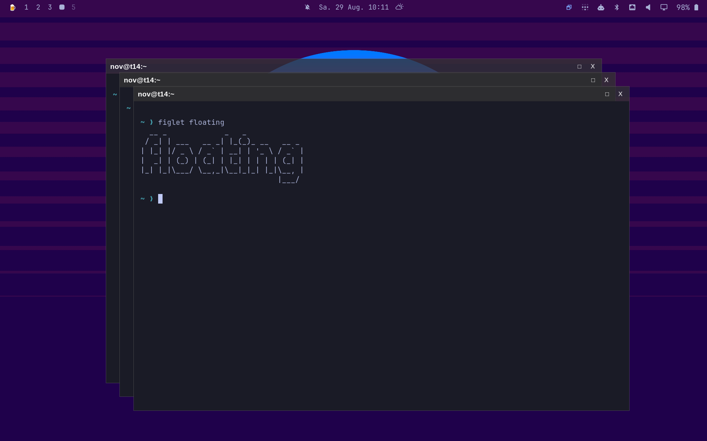

# Floating Window Mode for Omarchy

Floating Mode adds a clean tiled ↔ floating toggle to the Omarchy bar. It is designed especially for large and ultrawide monitors, where a single maximized application wastes space and traditional tiling can feel too rigid.

One click turns the current desktop into a calm, free-form workspace. Windows keep a useful visual arrangement, newly opened applications appear centered with comfortable margins, and another click returns every window managed by the plugin to tiling.



## What it does

- Toggles between tiled and floating workflows from one Omarchy bar button
- Floats existing tiled windows instantly, without distracting transition animations
- Automatically floats applications opened while Floating Mode is active
- Centers a lone or newly opened window at no more than 70% of the usable scaled screen area
- Never enlarges naturally smaller dialogs
- Preserves the overview on busy workspaces by keeping window positions and shrinking them only slightly
- Handles monitor scale, rotation, reserved bar space, and multi-monitor coordinates
- Leaves windows that were already floating untouched when returning to tiled mode
- Exits maximized or fullscreen state before restoring managed windows to tiling
- Adds a compact native titlebar for dragging, maximizing, and closing windows
- Magnetically aligns freely placed windows with nearby windows and monitor edges
- Snaps dragged windows into full-height columns, corner quarters, or maximization with a live preview
- Restores a window's previous size when it is dragged away from a snap zone
- Adds focused-window keyboard snapping while Floating Mode is active
- Restores a keyboard-snapped window to its original position and size

The result is simple: tiling when you want structure, floating when you want space and context.

## Requirements

### Runtime

- Omarchy 4 (Quattro)
- Hyprland 0.56 or newer
- Omarchy Shell / Quickshell
- `hyprctl`
- `jq`

These runtime components are included with a standard current Omarchy installation.

### One-time native integration build

The titlebar uses the official Hyprland `hyprbars` plugin with small bundled hover-background and disabled-input patches. Aero-style snap zones use the bundled MIT-licensed `omarchy-windows-snap` Hyprland plugin. The installer requires:

- Internet access to GitHub
- An interactive terminal
- `hyprpm`, `git`, `make`, `cmake`, `cpio`, `pkg-config`, `gcc`, and `g++`
- `sudo` permission to replace the cached `hyprbars.so`

The installer checks every required command before making changes. It builds both modules for the installed Hyprland ABI, verifies the snap geometry tests, saves the original hyprbars module, and restores it during uninstall. The upstream hyprbars source is pinned to reviewed commit `7644cecdb947060682891a0db2a0cdc5c0b9e704`.

On a minimal Arch-based installation, missing build tools can be installed with:

```bash
sudo pacman -S --needed base-devel cmake cpio git jq pkgconf
```

See [DEPENDENCIES.md](DEPENDENCIES.md) for the complete audited dependency and privilege list.

## Installation

Run these commands after the GitHub repository is public:

```bash
omarchy plugin add https://github.com/jwm3000/omarchy-windows.git --enable --yes
omarchy bar move io.github.jwm.floating-mode --section right
~/.config/omarchy/plugins/io.github.jwm.floating-mode/contrib/install-hyprbars
```

The final command is intentionally separate because Omarchy does not execute installation hooks or privileged commands when adding a plugin. Read [`contrib/install-hyprbars`](contrib/install-hyprbars) before running it if you want to review every system change.

## Usage

Click the overlapping-windows icon in the Omarchy bar:

- Normal icon: tiled mode
- Highlighted icon: Floating Mode is active
- Click again: managed windows return directly to tiling
- Right-click: open the Floating Mode settings

The menu automatically follows the desktop locale: German for a `de*` locale, English otherwise.

The **Focus border / Fokusrahmen** switch controls the active-window border while Floating Mode is on. Leave it enabled to keep the configured focus color, or disable it to give the focused window the same border color as inactive windows. The normal focus border is restored automatically when Floating Mode is turned off, and the preference persists across shell and login restarts.

Under **Window snap / Fenster-Snap**, the left and right screen edges can be configured independently:

- **Quarters / Viertel** keeps the upper and lower quarter zones on that side
- **Half / Hälfte** makes every edge and corner target on that side use the full-height half

For example, with the right side set to **Half / Hälfte**, dragging to the upper-right or lower-right corner selects the complete right half instead of a quarter. Both choices persist across restarts and apply from the next window drag.

The **Gaps / Abstände** switch is enabled by default. Turn it off to remove spacing between snapped windows for both drag snapping and the left/right keyboard shortcuts. The preference persists across restarts.

### Keyboard snapping

While Floating Mode is active, the following shortcuts operate on the currently focused window:

- `Ctrl`+`Super`+`Left` — snap to the full-height left half
- `Ctrl`+`Super`+`Right` — snap to the full-height right half
- `Ctrl`+`Super`+`Up` — maximize
- `Ctrl`+`Super`+`Down` — restore the position and size from before the first keyboard snap

The original geometry is retained while switching repeatedly between the left half, right half, and maximized state. `Ctrl`+`Super`+`Down` therefore returns the focused window to the same pre-snap geometry regardless of the intermediate sequence.

These bindings are registered only while Floating Mode is enabled and removed when it is disabled. The left and right keyboard shortcuts always select halves; the independent **Quarters / Half** menu choices affect mouse-drag snap zones only.

In Floating Mode, use either the native titlebar or `Super`+drag to move a window:

- Drag to the left or right edge for an outer full-height column, or the configured half
- In three-column mode, the bottom edge is split into equal left, center, and right full-height targets
- Drag to an upper corner or the upper/lower section of a side edge for a quarter-screen window
- Drag to the top center to maximize
- Move away from an edge before releasing to cancel the snap
- Drag a snapped window away to recover its pre-snap size

Hyprland draws a blurred blue preview with a 200 ms transition between zones. The square titlebar button toggles maximization; the close button closes the window.

Full-height snapping uses `columns = "auto"` by default: monitors wider than 16:9 get three columns, while 16:9 and narrower monitors keep two. When a side is configured for quarters, its corner zones remain quarters in either layout. To force one layout on every monitor, add this after `require("hypr.floating-mode")` in `~/.config/hypr/hyprland.lua`:

```lua
hl.config({ plugin = { omarchy_windows_snap = { columns = "2" } } }) -- or "3"
```

Hyprland's native magnetic snap is also enabled, so manually placed floating windows align to nearby windows and monitor edges without being resized.

Runtime state is kept in `$XDG_RUNTIME_DIR/omarchy-floating-mode` and disappears at logout. No window content is read or stored.
The runtime directory must be private and owned by the current user; unsafe directories, symlinks, and state files are rejected before use.

## Updating

Update community plugins with Omarchy:

```bash
omarchy plugin update --yes
```

If an update changes `contrib/hyprbars.lua`, `contrib/aero-snap/`, or the bundled hyprbars patches, rerun:

```bash
~/.config/omarchy/plugins/io.github.jwm.floating-mode/contrib/install-hyprbars
```

Because Hyprland plugins are ABI-sensitive, rerun the installer after a Hyprland update if either native module no longer loads.

## Removal

First click the bar button to return to tiled mode. Then run:

```bash
~/.config/omarchy/plugins/io.github.jwm.floating-mode/contrib/install-hyprbars --uninstall
omarchy plugin remove io.github.jwm.floating-mode --yes
```

The uninstall step removes the added Lua configuration and snap module, restores the original `hyprbars.so` and its previous enabled state, reloads Hyprland, and removes the plugin's installer state.

If the widget is unavailable while Floating Mode is still active, restore tiling manually before removing the plugin:

```bash
~/.config/omarchy/plugins/io.github.jwm.floating-mode/bin/floating-mode off
```

## How it works

The headless service watches for newly mapped tiled windows while the mode is enabled. Geometry is calculated in Hyprland's logical coordinate space, so fractional scaling and large displays remain predictable. Each transition is sent as one animation-free Hyprland batch to avoid visible intermediate layouts.

Only window addresses changed by Floating Mode are recorded. When the mode is disabled, only those windows return to tiling.

Titlebars are rendered inside the compositor by the official [`hyprbars`](https://github.com/hyprwm/hyprland-plugins/tree/main/hyprbars) plugin. The bundled [`hyprbars-button-hover.patch`](patches/hyprbars-button-hover.patch) adds configurable circular hover backgrounds, while [`hyprbars-disabled-input.patch`](patches/hyprbars-disabled-input.patch) carries [hyprland-plugins#701](https://github.com/hyprwm/hyprland-plugins/pull/701) for the pinned build.

The bundled `omarchy-windows-snap` plugin handles drag zones, previews, focused-window keyboard placement, and restoration inside Hyprland. Keyboard actions query Hyprland's current focus state directly, so they never target a window merely because it was previously active or happens to be highest in the stacking order.

## Privacy and security

- Runtime operation is local and unprivileged
- The plugin reads window geometry and metadata from `hyprctl`, never window contents
- No telemetry, analytics, network requests, or background downloads are used at runtime
- Network access occurs only when the explicit titlebar installer invokes `hyprpm` and clones the official Hyprland plugins repository
- `sudo` is used only to install or restore `/var/cache/hyprpm/$USER/hyprland-plugins/hyprbars.so`
- The Aero snap module is built from this repository's MIT-licensed source and installed without privileges below `$XDG_DATA_HOME/omarchy-floating-mode`
- Persistent configuration is limited to `~/.config/hypr/floating-mode.lua`, one `require(...)` line, the user-local snap module, and reversible state below `$XDG_STATE_HOME`

## Development and validation

```bash
omarchy plugin validate .
qmllint -I /usr/share/omarchy/shell BarWidget.qml Service.qml
bash -n bin/floating-mode contrib/install-hyprbars
make -C contrib/aero-snap test all
```

For a local test installation, clone or copy the repository to:

```text
~/.config/omarchy/plugins/io.github.jwm.floating-mode
```

Then rescan and enable it:

```bash
omarchy-shell shell rescanPlugins
omarchy plugin enable io.github.jwm.floating-mode
```

## Publishing on Omarchy Plugins

This repository already contains the required root-level `manifest.json`, README, MIT license, and optional preview image. Before submission:

1. Push the repository to `https://github.com/jwm3000/omarchy-windows` and make it public.
2. Confirm the default branch contains a clean release commit.
3. Run the validation commands above on current Omarchy.
4. Submit the public repository URL at [omarchyplugins.com](https://omarchyplugins.com/publish.html).

The marketplace validates the listing and repository layout; plugins themselves run with the user's normal account permissions.

## License

MIT — see [LICENSE](LICENSE).
